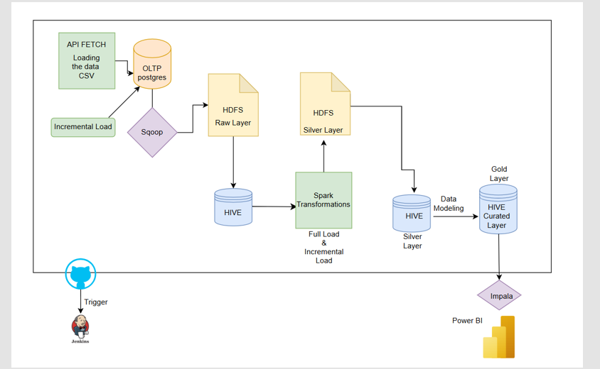

#  TFL Batch Data Pipeline

## Table of Contents
- [Project Overview](#project-overview)
- [Architecture & Pipeline Flow](#architecture--pipeline-flow)
- [Features & Integrations](#features--integrations)
- [Technologies Used](#technologies-used)
- [How to Run the Project](#how-to-run-the-project)
- [Future Enhancements](#future-enhancements)

## Project Overview

### Description
The **TFL Batch Data Pipeline** project simulates a real-world data engineering workflow by ingesting, transforming, and analyzing Transport for London (TFL) line status data.

The pipeline retrieves live updates from the TFL API, loads it into a structured data platform using Python, Postgres, Sqoop, Spark, and Hive, and produces analytics-ready datasets through the **Medallion Architecture (Bronze → Silver → Gold)**.

This project demonstrates:
- Batch processing with incremental ingestion  
- Schema alignment across multiple data sources  
- Partition management and metadata handling  
- Automated orchestration using Jenkins  
- Dashboarding using Power BI  

## Objectives
- Develop a scalable batch data pipeline  
- Ingest, clean, and standardize multi-source API data  
- Implement Bronze, Silver, and Gold architecture  
- Apply transformations (types, timestamps, duplicates, schema alignment)  
- Build analytical outputs using Impala and Power BI  
- Automate CI/CD using Jenkins  


## Architecture & Pipeline Flow

### End-to-End Flow



### Medallion Layers
- **Bronze:** Raw API data (CSV → HDFS)  
- **Silver:** Cleaned, standardized, deduplicated Parquet  
- **Gold:** Curated, data modelling (Star Schema)  

### Transformations Applied
- Schema alignment across 6 TFL lines  
- Composite-key deduplication  
- Timestamp normalization  
- Metadata enrichment  
- Partitioning by lineGroup & lineName  


## Features & Integrations
### 6 Data Sources
- Bakerloo  
- Central  
- Metropolitan  
- Northern  
- Piccadilly  
- Victoria  

### Python Scripts
- `rawdataextraction.py` – Extract API data  
- `dataintegration.py` – Load to Postgres (full + incremental)  
- `incremental_script.sh` – Sqoop incremental load  

### Processing
- Spark transformations (types, duplicates, enrichment)  
- HiveQL schemas for Silver & Gold layers  
- Partitioned Parquet output  

### Outputs
- Query: **Impala**  
- Dashboard: **Power BI** (delay trends, peak hours, disruptions)

## Technologies Used
- Python  
- PostgreSQL  
- Sqoop  
- HDFS  
- Hive  
- Spark  
- Impala  
- Jenkins  
- Power BI  
- GitHub  

## How to Run the Project

Follow the steps below to execute the TFL Batch Data Pipeline end-to-end.

1. Clone the repository: git clone https://github.com/ITC-UK/TFL_Data_Pipeline_Analytics_Hub.git
2. Run rawdataextraction.py to extract the data from the TFL APIs and save it as raw CSV files.
3. Run dataintegration.py to load the extracted raw data into PostgreSQL.Supports both full and incremental modes:

    python dataintegration.py --mode full
    python dataintegration.py --mode inc
4. Run incremental.sh to execute Sqoop commands for incremental load and move data into the HDFS Bronze layer.
5. Run Transformations_final.py to apply Spark transformations and write the cleaned data into the HDFS Silver layer.
6. Run tfl_gold_layer.hql to create the curated Gold Layer tables in Hive, which are used for analytics and business use cases.

## Project Structure 

### Milestone 1: Environment Setup
- Install Python, PostgreSQL, Hadoop, Hive, Spark, Sqoop, Impala.
- Configure HDFS directories for Bronze, Silver, and Gold layers.
- Set up necessary Python dependencies (`requirements.txt`).

### Milestone 2: API Extraction & Landing Zone
- Configure API endpoints for 6 TFL lines.
- Run `rawdataextraction.py` to extract data from TFL API.
- Validate and store raw CSV files.

### Milestone 3: Data Ingestion into PostgreSQL
- Run `dataintegration.py` for full and incremental loads.
- Validate schema and ensure records are correctly inserted.
- Monitor ingestion logs for failures.

### Milestone 4: Bronze Layer (Sqoop → HDFS)
- Configure Sqoop connection parameters.
- Run `incremental.sh` to export new records from Postgres to HDFS.
- Create Hive external tables on Bronze layer.

### Milestone 5: Silver Layer Transformations (Spark)
- Run `Transformations_final.py` to clean and standardize data.
- Apply schema alignment, timestamp normalization, deduplication.
- Store processed data as partitioned Parquet in HDFS Silver layer.

### Milestone 6: Gold Layer (Hive Data Modeling)
- Create Gold Layer curated tables using `tfl_gold_layer.hql`.
- Implement Star Schema for analytical use cases.
- Load curated tables into Impala.

### Milestone 7: BI & Dashboarding
- Connect Power BI to Impala.
- Build dashboards for delay trends, disruptions, and peak-hour analysis.

### Milestone 8: CI/CD Automation with Jenkins
- Automate extraction → ingestion → Bronze → Silver → Gold stages.
- Add notification triggers and error handling.
- Ensure pipeline reliability with MSCK REPAIR partition fixes.

## Jenkins CI/CD Pipeline

The entire TFL Batch Pipeline is automated using Jenkins to ensure reliable and scheduled execution.

### What Jenkins Automates:
- **Data Extraction** (`rawdataextraction.py`)
- **Postgres Ingestion** (`dataintegration.py`)
- **Sqoop Incremental Loads** (`incremental.sh`)
- **Spark Transformations** (`Transformations_final.py`)
- **Hive Gold Layer Refresh** (`tfl_gold_layer.hql`)

### Pipeline Features:
- **Cron-based scheduling** to refresh data at regular intervals  
- **Stage isolation**: if one stage fails, others are not affected   
- **Automatic partition repair** using  
  ```sql
  MSCK REPAIR TABLE table_name;

- GitHub Integration: Jenkins always pulls the latest version of the scripts

#### Benefits:
- Zero manual intervention
- Reproducible batch runs
- Faster debugging and better pipeline observability

## Future Enhancements
1. Move Orchestration to Apache Airflow
- Replace Jenkins with Apache Airflow for DAG-based orchestration
- Use task dependencies, retries, SLAs, and backfilling
- Monitor pipeline health via Airflow UI
- Enable scalable scheduling for multiple data sources

2. Kubernetes-Based Pipeline Orchestration
- Containerize Python, Spark, and Hive scripts using Docker
- Deploy workloads on Kubernetes (K8s)
- Use K8s CronJobs to schedule batch runs
- Enable auto-scaling of Spark executors using Spark on Kubernetes
- Improve resource utilization and deployment consistency

3. Machine Learning Predictions
- Build an ML model to predict:
    - Tube delays
    - Line congestion
    - Peak-hour patterns
    - Service disruptions
    - Use historical Gold-layer data for training
- Deploy model inference via:
    - Batch scoring in Airflow
    - Real-time scoring in a REST API
    - Visualize predictions in Power BI dashboards