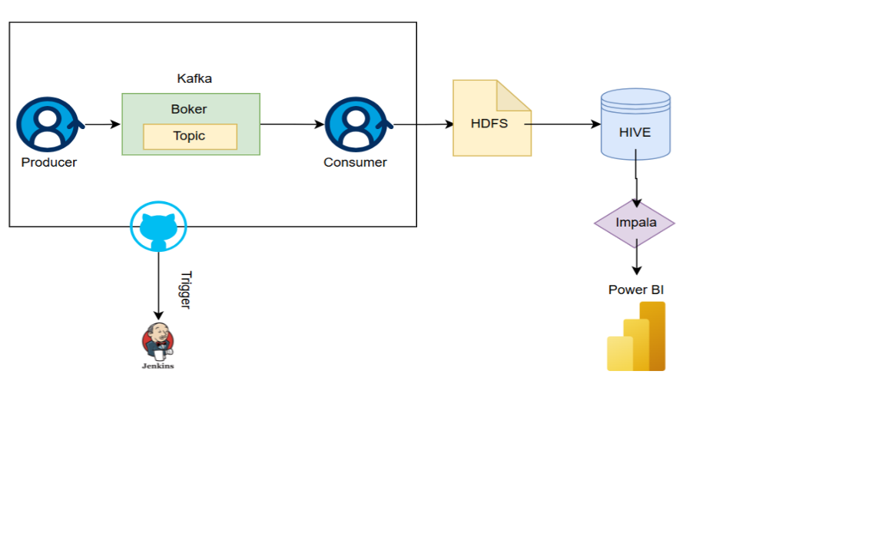

# TFL Streaming Data Pipeline (Short Version)

Purpose:
Kafka-based streaming pipeline for TFL real-time data.

- Producer: Polls TFL APIs → enriches events → sends to Kafka.
- Consumer: Spark Structured Streaming → reads Kafka → parses, deduplicates → writes to HDFS (Delta/Parquet).

---

---

Project Structure:

src/

├── producer.py

├── consumer.py

├── tests/

config/dev.yaml
data/

---

Setup:

1. Clone the repository:
   git clone https://github.com/ITC-UK/TFL_Data_Pipeline_Analytics_Hub.git
   cd TFL_Streaming

2. Create and activate virtual environment:
   python -m venv venv
   source venv/bin/activate  (Windows: venv\Scripts\activate)

3. Install dependencies:
   pip install -r requirements.txt

4. Ensure Kafka and HDFS are running as per config/dev.yaml

---

Running:

Producer (single run):
   python src/producer.py

Consumer (batch mode, once):
   python src/consumer.py

---

Testing:

- Pytest with mocks for Kafka & HTTP calls
- Producer: Kafka setup, fetch, enrich, send, shutdown
- Consumer: Parse, enrich, deduplicate, send, shutdown

Run tests:
   pytest -v -s --log-cli-level=INFO

---

Notes:

- Producer and consumer run independently
- Configuration is centralized in config/dev.yaml
- Tests do not hit real services; everything is mocked

---

Author: Lewis TWelftree
Date: 2025-12-07
